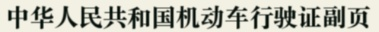
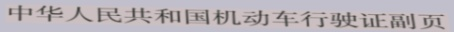
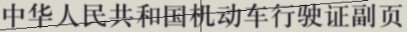
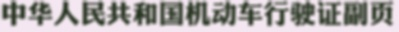
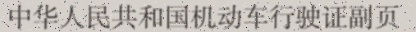
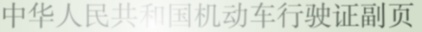
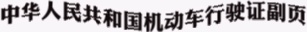
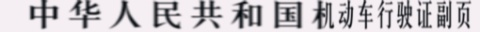

# Text Recognition Data Generator
文本识别人工数据生成 

---
## 图片效果

### 常规文本

### 倾斜文本

### 画线（水平与垂直线、倾斜线）

### 画椭圆

### 高斯模糊

### 添加噪点

### 亮斑点（模仿光照反射的情形）

### 曲线文本

### 水平拉伸

以上效果可以叠加使用，也可以随机添加，各种效果随机出现的概率可以在[generate.py](generate.py)的第24行修改

---
## 使用方法
使用很简单，[generate.py](generate.py)最后有使用的demo。
